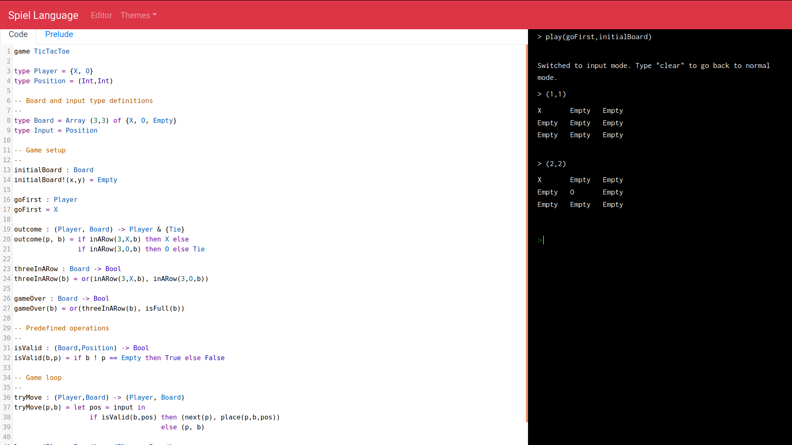

# Spiel Lang

## What is Spiel Lang?

Spiel Lang is a domain specific teaching language for teaching young students algorithms. It serves as a simple first step language into computer science.

## Using it Now

[You can check out Spiel Lang for yourself here](http://bogl.engr.oregonstate.edu:5168/).

## About

Spiel Lang is an Oregon State University capstone project designed and developed from 2019-2020 by Alex Grejuc, Calvin Gagliano, Kai Gay, and Benjamin Friedman, at the behest of Professor Martin Erwig. You can read a [brief description](https://the-code-in-sheep-s-clothing.github.io/Spiel-Lang/requirements) or a [comprehensive description](https://github.com/The-Code-In-Sheep-s-Clothing/Spiel-Lang/blob/master/Project_Requirements/CS_461_Project_Requirements.pdf) of the project requirements for more detail.

### Why Spiel Lang?

Fully equipped programming languages such as Java, C++, or Python are commonly used as first languages today. For practical application, this makes sense, but it's not always easy to understand the concepts for the algorithms involved until you understand a large portion of the language. Spiel attempts to address this problem by providing an incredibly simple language that is focused on describing only board games. By keeping the language succinct, and choosing a focus which is not unfamiliar to most young students, Spiel can help introduce the underlying algorithms and computer science concepts quickly.

### Getting Started

You can get started with our [tutorials here](Tutorials/All.md). This includes a further breakdown of what Spiel is, and help to get started on your first program.

If you want to develop on Spiel locally, please refer to our [installation page](INSTALLATION) for more details.
