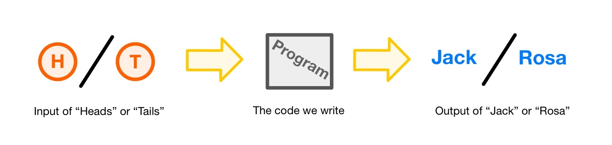
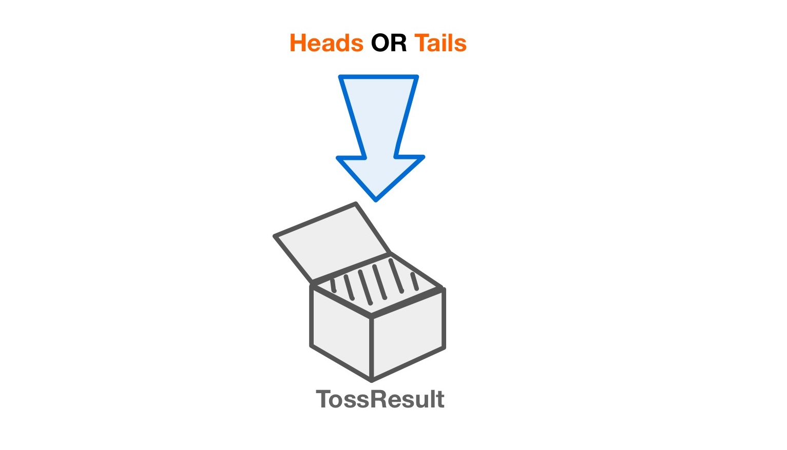
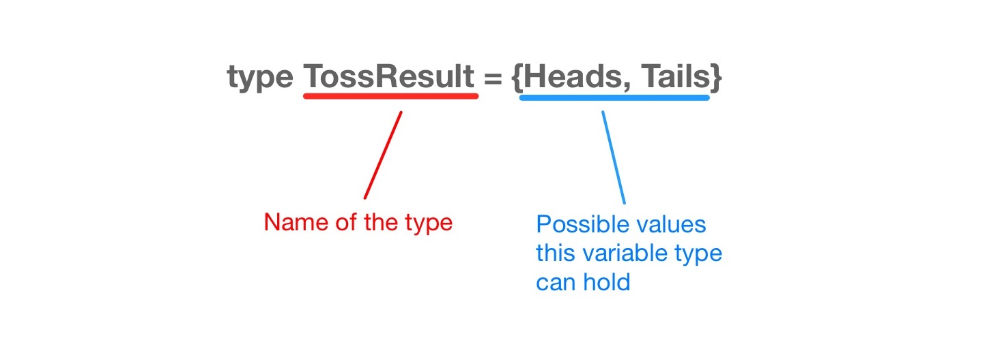

# 2) Understanding Types

[Previous Tutorial](GettingStarted)

Jack and Rosa want to play a board game. They decide that who gets to go first should be determined by the result of a coin toss.

In this tutorial we will create a program using the BoGL language that will take the result of a coin toss and choose who gets to go first based on that result.

In order to do this, our program must be able to...

1. Capture the inputted value of the coin toss result.
2. Output whether Jack or Rosa gets to go first based off of the result value.



We will start out by creating our game.

`game WhoGoesFirst`

Next we will capture the coin toss result. For this we are going to create a variable type that allows for storing the result of a coin toss.




There are currently no defined types for a coin toss result (as there are for integers and booleans), so we will make one ourselves!
The pieces of information we need to create our own type are: 

* The name we want to call our type
* The possible values that a variable of our type can hold

To define a type, we must first use the keyword `type` in our program, followed by the desired name for our type. It is required by the language that the first letter of this name is capitalized. We will then define what the possible values are for this type using the `=` operator, followed then by a list of the possible values, seperated by commas, and contained within `{}` brackets. These values will also be given desired names (with their first letters capitalized). It will end up looking like this:

```
type TossResult = {Heads, Tails}
```



Think of a variable as a box, and the variable's type as what is allowed to be put inside the box. Below are a few more examples of user defined types that do not pertain to coin results, just to nail down the concept of defining types!

 ```
 -- board game themed types
 type CardSuit = {Diamond, Club, Heart, Spade}
 type PlayerColor = {Blue, Red, Green, Yellow}
 type DiceResult = {One, Two, Three, Four, Five, Six}
 type ChessPiece = {Pawn, Bishop, Knight, Rook, Queen, King}
 
 -- non board game themed types
 type ClassicIceCreamFlavor = {Vanilla, Chocolate, Strawberry}
 type WaterValveState = {Open, Closed}
 type StateOfMatter = {Solid, Liquid, Gas, Plasma}
 type VertebrateAnimal = {Mammal, Reptile, Amphibian, Bird, Fish} 
 ```


[Next, we'll show you how the program can utilize the TossResult type we created](TheGame).
