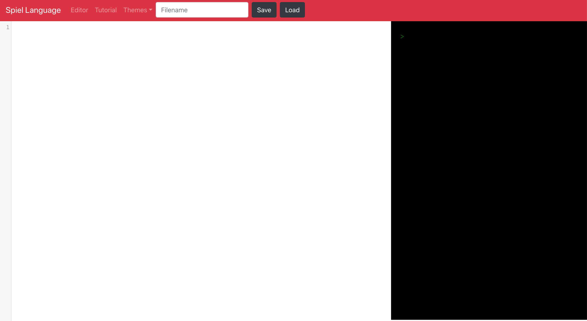

# 1) Getting Started with Spiel

Getting started with Spiel is straightforward, as you can start coding directly in our [online tool](access.engr.orst.edu:5168/). However this is currently limited to OSU students, staff, and faculty that have access to the OSU network directly or via a VPN.

Once you have access to the tool you should see the page as follows:

There are 2 main areas of focus.

The white screen on the left is **Editor**, this is where you can type in your code to run.

The black screen on the right is the **Command Prompt**. This is where you can run your spiel programs, checking the results of your code. You can also get feedback for errors and issues. When you start a game, you will be able to interact with it from this screen as well.

In the current iteration there is a Save/Load button at the top with a text field. You will need to first save your program before you can run it in the **Command Prompt**.

[Next, let's talk about your first Spiel program.](Intro)
