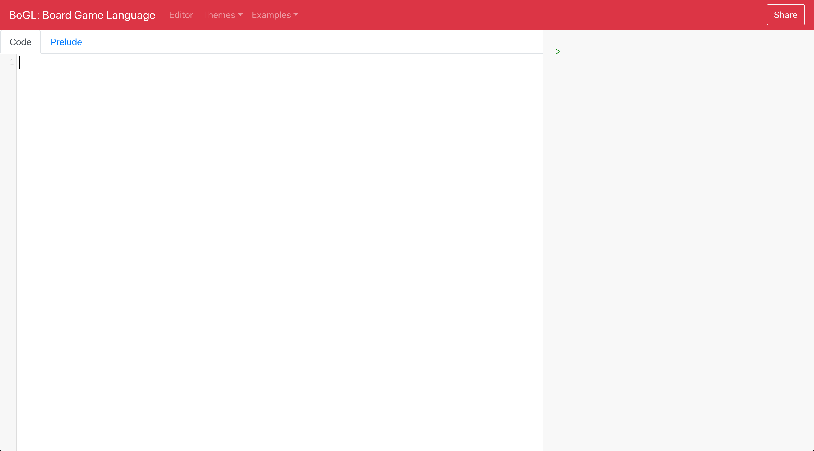

# 1) Getting Started with BoGL

--------------
### New Tutorial Location
These tutorials are out of date, and will be removed. The new location for all up to-date BoGL information will is https://bogl.engr.oregonstate.edu/tutorials/.
--------------

Getting started with BoGL is straightforward, as you can start coding directly in our [online tool](https://bogl.engr.oregonstate.edu/).


Once you have access to the tool you should see the page as follows:


There are 2 main areas of focus.

The white screen on the left is **editor**, this is where you can type in your code to run. A simple BoGL program might be written as follows in the white portion of the screen:
```
game Example

test : Int
test = 12345
```
You may not know exactly what this does yet, but that's okay, we'll get to it later in the tutorial. The important part here is to understand the layout of the tool. Make sure you type this into the white section, and that the tab at the top has 'Code' selected (not Prelude). The default is to have Code already selected.


The gray section on the right is the **Interpreter**. It repeats the process of reading the command you entered (an **expression**), evaluating it, and displaying the result. This may sound a bit fancy, but if you type something like `5` into the Interpreter, and hit **Enter**, you'll get back `5` (since 5 is 5!). Similarly, typing in a simple expression like `5+5` will give you back `10`, or `1+2*3` will give you back `7`. Feel free to play around with some other operators like subtraction, and to get a feel for how you can type in and use expressions.


This same gray section is where you can run your BoGL programs, and check the results of interpreting what you typed in. You can also get feedback for errors and issues. When you start a game, you will be able to interact with it from this screen as well. Think of this like your window into the BoGL computer, where you can talk to it, and it can talk back to you. In the case of the simple `Example` program we wrote before, you can type `test` into the interpreter, hit **Enter**, and you should get back an Integer of `12345`!


One thing that you should keep in mind is that you must have a valid program in the editor (the left white screen) to be able to run anything in the interpreter. This is because BoGL evaluates what you type into the interpreter after first preparing everything you wrote in the white screen. If you have a mistake there, it won't be able to get ready to work, and it will indicate that with an error message of some form. If your BoGL program on the left screen is correct, it will be able to prepare and allow you to evaluate expressions normally; as well as have access to anything you wrote in your BoGL program. Any updates you make in the editor on the left will be reflected in the interpreter expression you enter afterwards.
[Next, let's talk about your first BoGL program.](Intro)
